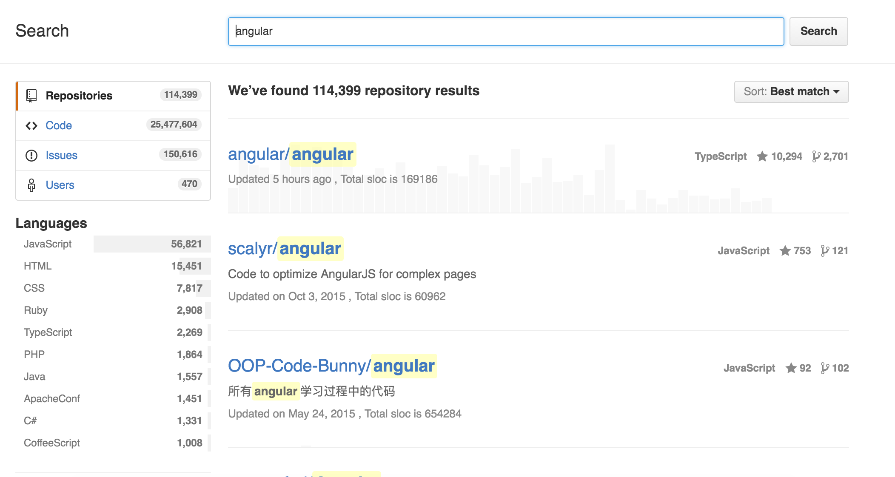

# Github Sloc

An Chrome extension to display how many lines of code the project consists of when you search on Github.

# Usage

Clone this repo, go to chrome://extensions/ check developer mode, click load unpacked extension.

In options page set your personal access token there.