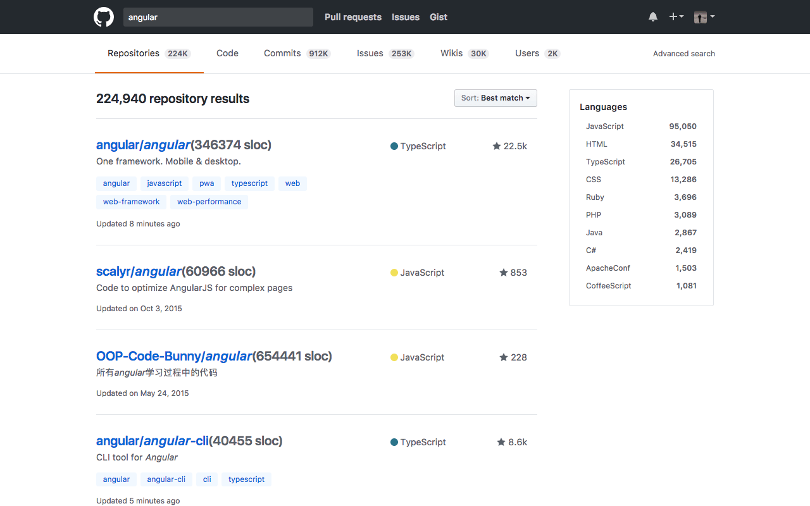
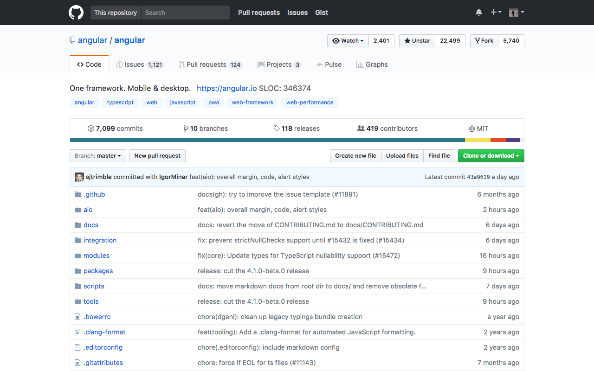

GitHub SLOC is an Chrome extension to view the number of source line of codes of projects on GitHub.

```
          _ __  __          __            __          
   ____ _(_) /_/ /_  __  __/ /_     _____/ /___  _____
  / __ `/ / __/ __ \/ / / / __ \   / ___/ / __ \/ ___/
 / /_/ / / /_/ / / / /_/ / /_/ /  (__  ) / /_/ / /__  
 \__, /_/\__/_/ /_/\__,_/_.___/  /____/_/\____/\___/  
/____/                                                
```

# Usage

Install from [Chrome Web Store](https://chrome.google.com/webstore/detail/github-sloc/fkjjjamhihnjmihibcmdnianbcbccpnn). 

Or clone this repo, go to chrome://extensions/ check developer mode, click load unpacked extension to load this extension. 
Then go to options page set your personal access token there.

# Snapshots





