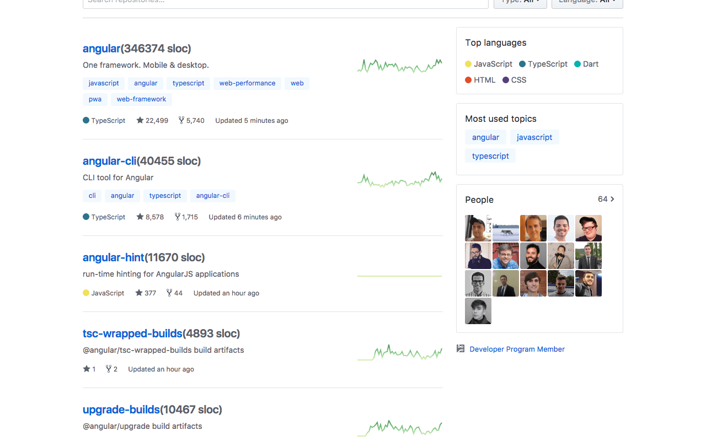

# GitHub SLOC

An Chrome extension to view SLOC on GitHub.

# Usage

Install from [Chrome web store](https://chrome.google.com/webstore/detail/github-sloc/fkjjjamhihnjmihibcmdnianbcbccpnn). Or clone this repo, go to chrome://extensions/ check developer mode, click load unpacked extension to load this extension.

Then go to options page set your personal access token there.

# Snapshots

